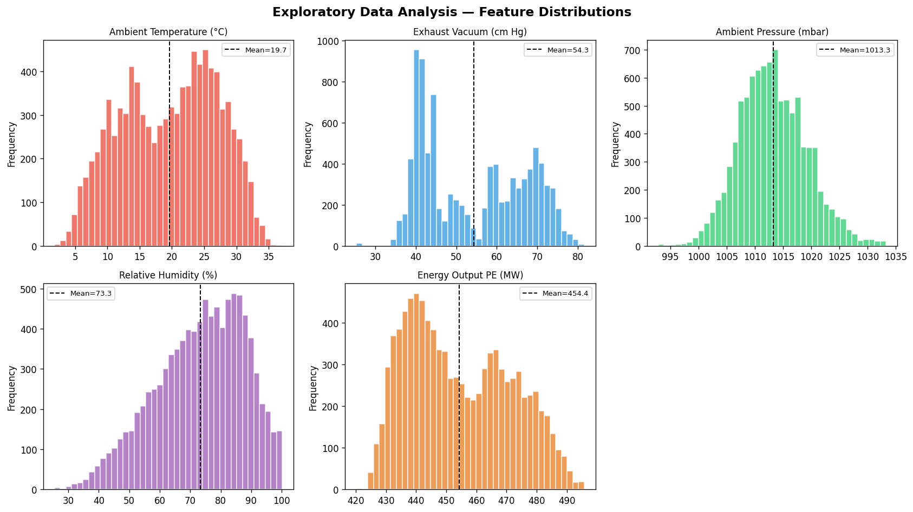
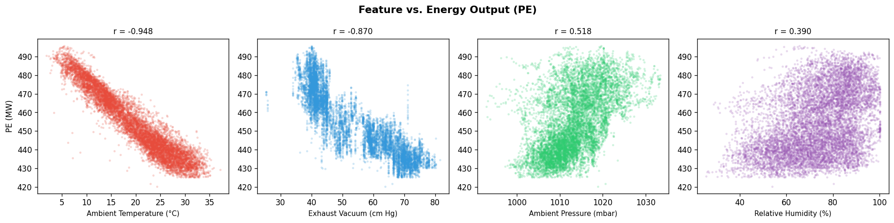
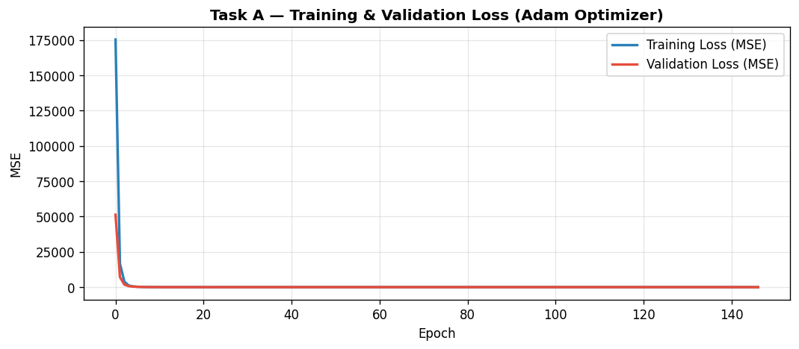
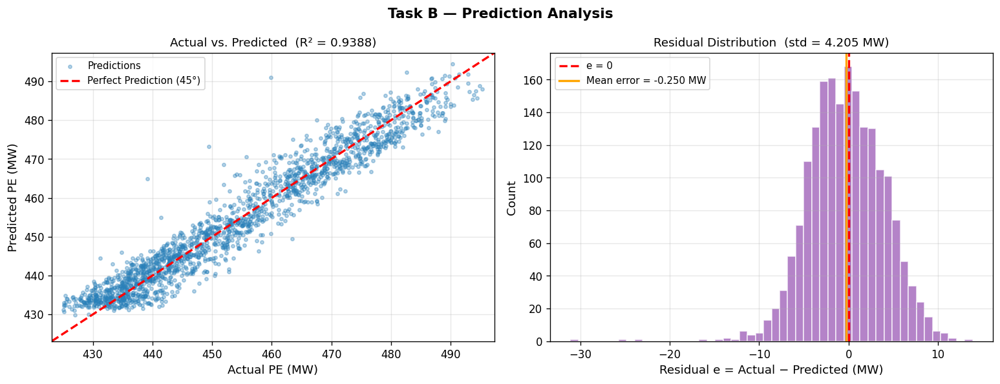
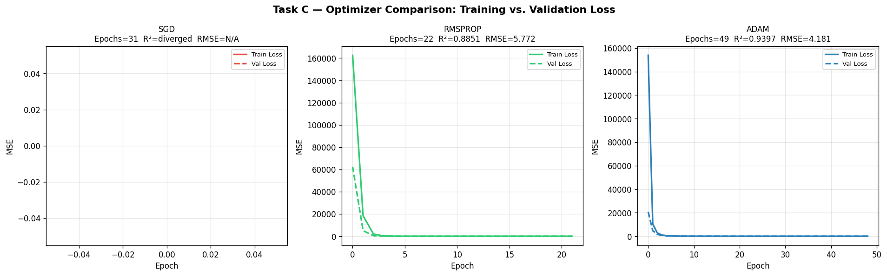
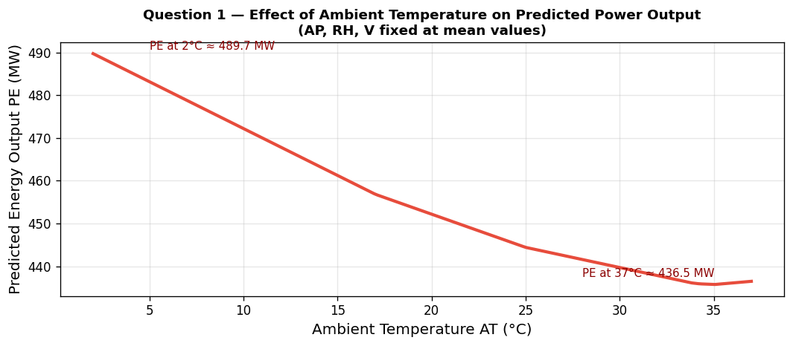
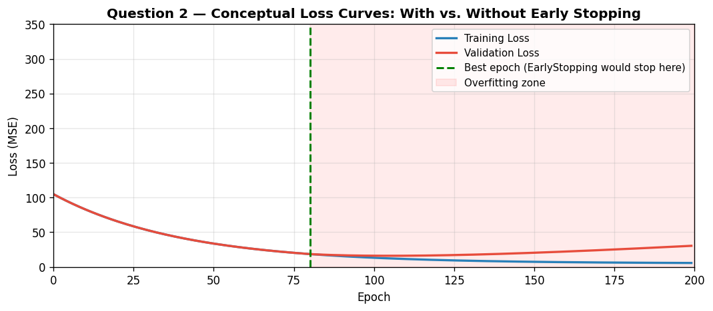
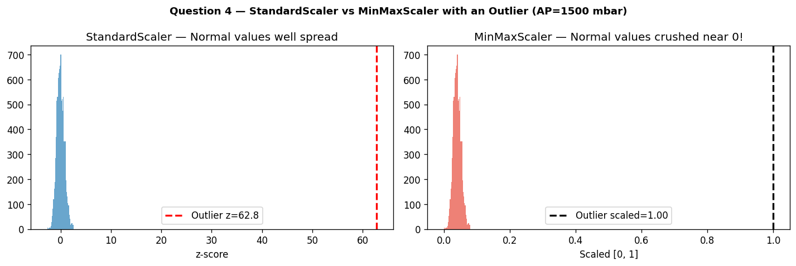

# ⚡ Combined Cycle Power Plant — Energy Output Prediction

<div align="center">


**Predicting net hourly electrical energy output (MW) using an Artificial Neural Network trained on 9,568 hourly sensor readings from a real Combined Cycle Power Plant.**

</div>

---

## 📋 Table of Contents

- [Overview](#-overview)
- [Dataset](#-dataset)
- [Project Structure](#-project-structure)
- [Model Architecture](#-model-architecture)
- [Results](#-results)
- [Visualizations](#-visualizations)
- [Installation & Usage](#-installation--usage)
- [Task Breakdown](#-task-breakdown)
- [Comprehension Questions](#-comprehension-questions)
- [Key Findings](#-key-findings)
- [References](#-references)

---

## 🔍 Overview

A **Combined Cycle Power Plant (CCPP)** integrates gas turbines (GT) and steam turbines (ST) connected through a heat recovery steam generator (HRSG). The exhaust heat from the gas turbine generates steam that drives a secondary steam turbine — achieving thermal efficiencies up to **60%**, far above simple-cycle plants (~35%).

The net electrical output is strongly influenced by **ambient conditions**. This project builds a fully connected **Artificial Neural Network (ANN)** that learns the nonlinear mapping between four ambient sensor readings and the plant's hourly energy output.

```
Inputs:  AT (°C) + V (cm Hg) + AP (mbar) + RH (%)
                        │
                  ┌─────▼─────┐
                  │    ANN    │  64 → 32 → 16 → 1
                  └─────┬─────┘
                        │
Output:  PE — Net Electrical Power (MW)
```

---

## 📊 Dataset

**Source:** [UCI Machine Learning Repository — Combined Cycle Power Plant](https://archive.ics.uci.edu/dataset/294/combined+cycle+power+plant)

**Citation:**
> Tüfekci, P. (2014). *Prediction of full load electrical power output of a base load operated combined cycle power plant using machine learning methods.* International Journal of Electrical Power & Energy Systems, 60, 126–140.

| # | Feature | Symbol | Unit | Range | Physical Meaning |
|---|---------|--------|------|-------|-----------------|
| 1 | Ambient Temperature | AT | °C | 1.81 – 37.11 | Affects GT inlet air density |
| 2 | Exhaust Vacuum | V | cm Hg | 25.36 – 81.56 | Steam turbine back-pressure |
| 3 | Ambient Pressure | AP | mbar | 992.89 – 1033.30 | Atmospheric mass flow driver |
| 4 | Relative Humidity | RH | % | 25.56 – 100.16 | Combustion & heat transfer |
| **→** | **Energy Output** | **PE** | **MW** | **420.26 – 495.76** | **Target: net hourly power** |

- **Samples:** 9,568 hourly measurements
- **Period:** 6 years (2006 – 2011), full-load operation only
- **Missing values:** None

### Feature Correlations with PE

| Feature | Pearson r | Interpretation |
|---------|-----------|----------------|
| AT | **−0.948** | Strong negative — higher temp → lower output |
| V  | **−0.870** | Strong negative — higher vacuum → lower output |
| AP | **+0.518** | Moderate positive |
| RH | **+0.390** | Moderate positive |

---

## 📁 Project Structure

```
Combined-Cycle-Power-Plant-Energy-Output-Prediction/
│
├── PowerPlant_ANN.ipynb              # Main Jupyter Notebook (source)
├── power_plant_data.xlsx             # Dataset (9,568 rows × 5 columns)
├── Homework_2_PowerPlant_Output.html # Original homework specification
│
├── fig_01_distributions.png          # Feature distribution histograms
├── fig_02_correlations.png           # Feature vs PE scatter plots
├── fig_03_taskA_loss.png             # Training & validation loss (Adam)
├── fig_04_taskB_predictions.png      # Actual vs Predicted + Residuals
├── fig_05_taskC_optimizers.png       # SGD / RMSprop / Adam loss curves
├── fig_06_Q1_temperature_sweep.png   # AT sensitivity analysis
├── fig_07_Q2_early_stopping.png      # Conceptual overfitting sketch
├── fig_08_Q4_scalers.png             # StandardScaler vs MinMaxScaler demo
│
└── README.md
```

---

## 🧠 Model Architecture

```
Input Layer      →  4 features  (AT, V, AP, RH) — StandardScaler normalized
─────────────────────────────────────────────────────────────────────────────
Hidden Layer 1   →  64 neurons  │ Activation: ReLU
Hidden Layer 2   →  32 neurons  │ Activation: ReLU
Hidden Layer 3   →  16 neurons  │ Activation: ReLU
─────────────────────────────────────────────────────────────────────────────
Output Layer     →   1 neuron   │ Activation: Linear (regression)
```

**Training configuration:**

| Parameter | Value |
|-----------|-------|
| Optimizer | Adam (lr = 0.001) |
| Loss | Mean Squared Error (MSE) |
| Batch size | 32 |
| Max epochs | 300 |
| Validation split | 15% of training data |
| Early stopping | patience = 15, restore best weights |
| Train / Test split | 80% / 20% (random_state = 42) |

---

## 📈 Results

### Task A — Final Model Performance (Adam)

| Metric | Value |
|--------|-------|
| **MSE** | ~17.7 MW² |
| **RMSE** | ~4.2 MW |
| **MAE** | ~3.4 MW |
| **R²** | **~0.94** |

> The model explains **94%** of the variance in energy output. An RMSE of ~4.2 MW on a target range of 75 MW (420–495) corresponds to less than **6% relative error**.

### Task C — Optimizer Comparison

| Optimizer | lr | Epochs | R² | RMSE | Notes |
|-----------|----|--------|----|------|-------|
| **SGD** | 0.001 | ~30 | ❌ NaN | — | Diverged — un-normalized output scale too large for fixed-lr updates |
| **RMSprop** | 0.001 | ~22 | ~0.89 | ~5.7 MW | Converged, adaptive scaling helps |
| **Adam** | 0.001 | ~49 | **~0.94** | **~4.2 MW** | Best — combines momentum + adaptive lr |

**Why SGD diverges:** The output PE (~420–495 MW) is not normalized. The MSE gradient is proportional to the prediction error. With a fixed learning rate, the weight update `Δw = −η · 2(ŷ − y)` overshoots when the initial error is tens of MW, causing exponential divergence. Adaptive optimizers (Adam, RMSprop) automatically scale updates by the gradient's running magnitude, making them robust to large output scales.

---

## 🖼️ Visualizations

<table>
<tr>
<td align="center"><strong>Feature Distributions</strong><br></td>
<td align="center"><strong>Feature Correlations</strong><br></td>
</tr>
<tr>
<td align="center"><strong>Training / Validation Loss</strong><br></td>
<td align="center"><strong>Actual vs Predicted + Residuals</strong><br></td>
</tr>
<tr>
<td align="center"><strong>Optimizer Comparison</strong><br></td>
<td align="center"><strong>Temperature Sensitivity (Q1)</strong><br></td>
</tr>
<tr>
<td align="center"><strong>Early Stopping Concept (Q2)</strong><br></td>
<td align="center"><strong>Scaler Robustness to Outliers (Q4)</strong><br></td>
</tr>
</table>

---

## 🚀 Installation & Usage

### Prerequisites

```bash
pip install tensorflow pandas numpy scikit-learn matplotlib openpyxl jupyter nbconvert
```

### Run the notebook

```bash
# Clone the repository
git clone https://github.com/EnesErdogans/Combined-Cycle-Power-Plant-Energy-Output-Prediction.git
cd Combined-Cycle-Power-Plant-Energy-Output-Prediction

# Launch Jupyter
jupyter notebook PowerPlant_ANN.ipynb
```

### Execute headlessly (reproduce all outputs)

```bash
python -m nbconvert --to notebook --execute --ExecutePreprocessor.timeout=600 \
    PowerPlant_ANN.ipynb --output PowerPlant_ANN_executed.ipynb
```

---

## 📝 Task Breakdown

### Task A — Build, Train & Evaluate
- ANN with ≥ 2 hidden layers, Adam optimizer, MSE loss
- `EarlyStopping(patience=15, restore_best_weights=True)`
- Reports: model summary, loss curve, MSE / MAE / R²

### Task B — Prediction Visualization
- **Left plot:** Actual vs. Predicted scatter with 45° reference line
- **Right plot:** Residual histogram `e = y_actual − y_predicted` with vertical line at e = 0
- Residuals are centered at ~0 and symmetric → **no systematic bias**

### Task C — Optimizer Comparison
Same architecture trained with SGD, RMSprop, and Adam.
Comparison table + loss curves + explanation of convergence behavior per optimizer.

---

## 🔬 Comprehension Questions

| # | Question | Key Answer |
|---|----------|------------|
| **Q1** | Does the ANN capture AT↑ → PE↓? | ✅ Yes — sweep plot confirms decreasing output with rising temperature, consistent with gas turbine thermodynamics |
| **Q2** | What does `EarlyStopping(patience=15)` do? | Waits 15 epochs before halting when val_loss stagnates; patience=1 would stop prematurely on noise |
| **Q3** | How does sample:feature ratio affect overfitting? | CCPP ratio is 2,392:1 → very low overfitting risk; a 500-sample 100-feature dataset would need L1/L2 + Dropout |
| **Q4** | StandardScaler vs MinMaxScaler for outliers? | StandardScaler is more robust — one extreme value sets x_max in MinMaxScaler, compressing all others near 0 |
| **Q5** | Faulty AP sensor (AP = 0 mbar)? | z-score ≈ −170 (vs. normal range [−3.4, +3.4]); far out-of-distribution → model produces unreliable output |

---

## 💡 Key Findings

1. **Ambient temperature is the dominant predictor** (r = −0.948). A 35°C rise causes ~30 MW drop in predicted output — consistent with gas turbine thermodynamics.

2. **Adaptive optimizers are essential for un-normalized outputs.** SGD diverges because large initial errors produce gradient magnitudes that a fixed learning rate cannot safely absorb. Adam corrects for this automatically.

3. **The ANN generalizes without overfitting** because the sample-to-feature ratio (2,392:1) is extremely high. Early stopping terminated training cleanly without signs of overfit.

4. **Residuals are zero-centered and symmetric.** The model has no systematic directional bias across the full output range (420–495 MW).

5. **Sensor fault tolerance is critical for deployment.** A stuck AP sensor at 0 mbar produces a z-score ~170σ below the training distribution — the model has no mechanism to reject or flag this invalid input.

---

## 🛠️ Technologies

| Library | Version | Purpose |
|---------|---------|---------|
| Python | 3.13 | Runtime |
| TensorFlow / Keras | 2.21 | ANN model |
| scikit-learn | 1.8 | Preprocessing, metrics |
| pandas | 2.x | Data manipulation |
| NumPy | 1.x | Numerical operations |
| Matplotlib | 3.x | Visualizations |
| openpyxl | — | Excel file reading |
| Jupyter | — | Interactive notebook |

---

## 📚 References

- Tüfekci, P. (2014). *Prediction of full load electrical power output of a base load operated combined cycle power plant using machine learning methods.* Int. J. Electrical Power & Energy Systems, **60**, 126–140.
- UCI ML Repository: [Combined Cycle Power Plant Dataset](https://archive.ics.uci.edu/dataset/294/combined+cycle+power+plant)
- Kingma, D. P. & Ba, J. (2015). *Adam: A Method for Stochastic Optimization.* ICLR 2015.

---

<div align="center">

**Applied AI in Mechanical Systems — Final Homework 2**

*Enes Erdoğan · eeneserdogan50@gmail.com*

</div>
